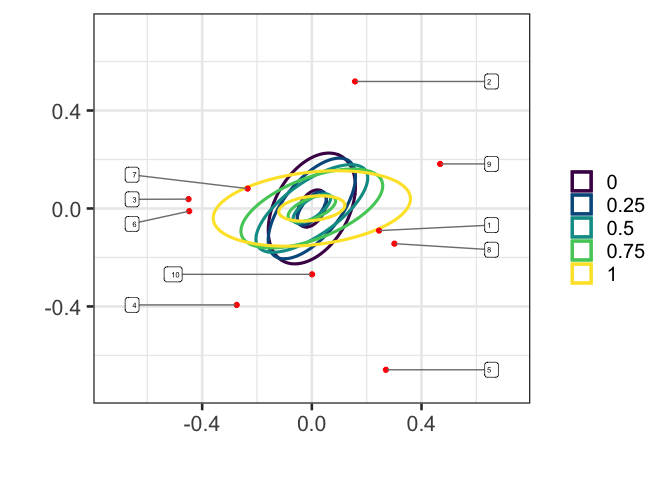

## Background

`envelopeR` is the R package associated with the paper \`\`Reducing
Subspace Models for Large-Scale Covariance Regression’’.

**Summary:** We develop an envelope model for joint mean and covariance
regression in the large \(p\), small \(n\) setting. In contrast to
existing envelope methods, which improve mean estimates by incorporating
estimates of the covariance structure, we focus on identifying
covariance heterogeneity by incorporating information about mean-level
differences. We use a Monte Carlo EM algorithm to identify a
low-dimensional subspace which explains differences in both means and
covariances as a function of covariates, and then use MCMC to estimate
the posterior uncertainty conditional on the inferred low-dimensional
subspace. We demonstrate the utility of our model on a motivating
application on the metabolomics of aging.

Preprint: <https://arxiv.org/abs/2010.00503>

Addition Readme's can be found in `simulation/` and `metabolomics/` folders on how to run the scripts which generated the figures in the paper.

## Installation

``` r
devtools::install_github("afranks86/envelopeR")
```

## A Test Dataset

``` r
library(envelopeR)

test_data <- generate_test_data(q=2, cov_rank=2, intercept=TRUE, gamma_sd=1, error_sd=1, seed=4445)
Y <- test_data$Y
X  <- test_data$X
s  <- test_data$s
p  <- test_data$p
V  <- test_data$V
```

## Fit the Envelope model

``` r
## `get_rank` can be used to infer the appropriate dimension of hte subspace of material variation
s_hat <- getRank(Y)

envfit <- fit_envelope(Y, X, distn="covreg", s=s_hat,
                       Vinit="OLS",
                       verbose_covreg=FALSE)
```

Check inferred subspace is close to the true material subspace (1 means
they are identical subspaces). We also show that the goodness of fit
test on sphericity of the subspace of material variation does not
produce a small p-value.

``` r
print(sprintf("Subspace similarity: %f", 
              tr(envfit$V  %*% t(envfit$V)  %*% V  %*% t(V))/s))
```

    ## [1] "Subspace similarity: 0.993486"

``` r
## Sphericity test: if small pvalue, reject isotropy of immaterial subspace
Vperp <- NullC(envfit$V) 
print(sprintf("P-value of sphericity test is: %f", 
              test_sphericity(Y %*% Vperp)$p.value))
```

    ## [1] "P-value of sphericity test is: 0.882835"

Re-run full Bayesian inference conditional on the inferred subspace of
material variation. We do this to run the sampler for longer iterations
than the default returned by the EM algorithm. We can also get
`cov_psamp` from the list returned by `fit_envelope` by running
`cov_psamp <- cov.psamp(envfit$covariance_list$covreg_res)` (default 100
iterations).

``` r
YV  <- Y %*% envfit$V
res  <-  covreg::covreg.mcmc(YV ~ X - 1, YV ~ X, niter=10000, nthin=10, verb=FALSE)
cov_psamp  <- covreg::cov.psamp(res)
cov_psamp  <- cov_psamp[, , , 1:1000]
```

## Plotting

### Posterior plot

We plot posterior samples of \(\Psi_x\) for minimum, maximum and
quartiles of the first covariate \(X_1\). Non-overlapping groups is
suggestive of differences in the covariances a posteriori.

``` r
type  <- "mag"

## plot posterior distributions for min, max and quartiles of X
ix <- sort(X[, 1], index.return=TRUE)$ix
obs_to_plot <- ix[c(1, 25, 50, 75, 100)]

## values correspond to the quantiles of x
names(obs_to_plot)  <- c(0, 0.25, 0.5, 0.75, 1)

cols <- colorspace::sequential_hcl(5, "viridis")

post  <- create_plots(envfit$V, cov_psamp,
                      n1=obs_to_plot[1], n2=obs_to_plot[length(obs_to_plot)],
                      to_plot = obs_to_plot, col_values=cols,
                      labels=colnames(Y), plot_type="posterior", alpha=0.5)
```

    ## Warning: The `x` argument of `as_tibble.matrix()` must have unique column names if `.name_repair` is omitted as of tibble 2.0.0.
    ## Using compatibility `.name_repair`.

``` r
post
```

<!-- -->

The true eigenvalues and angles on this two-dimensional subspaces are
below.

    ## # A tibble: 5 x 3
    ##   quantile  eval angle
    ##   <chr>    <dbl> <dbl>
    ## 1 0          8.5 1.23 
    ## 2 0.25      10.6 1.00 
    ## 3 0.5       13.3 0.723
    ## 4 0.75      15.3 0.522
    ## 5 1         18.3 0.204

### Biplot

Contours show posterior mean covariances matrices for \(\Psi_x\). Points
represent the largest magnitue loadings on this two-dimensional subspace.
We choose the subspace to maximize the difference in covariance matrices
between observation \(n_1\) and \(n_2\)

``` r
rownames(envfit$V)  <- 1:p
biplot  <- create_plots(envfit$V, cov_psamp,
                        n1=obs_to_plot[1], n2=obs_to_plot[length(obs_to_plot)],
                        to_plot = obs_to_plot, col_values=cols,
                        labels=colnames(Y), plot_type="biplot")
biplot
```

<!-- -->
